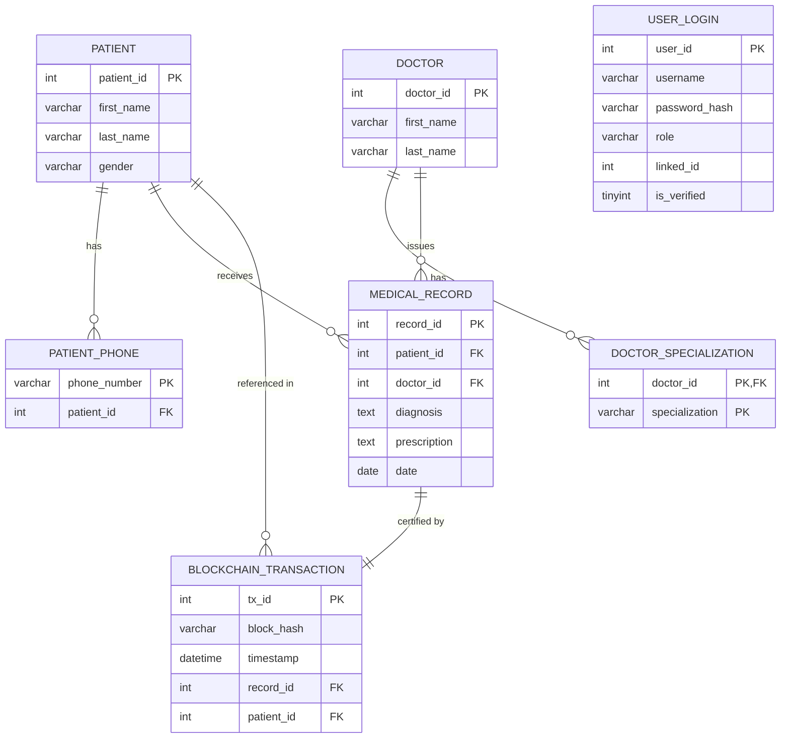

# 📋 EHR System — Complete Database Documentation

> **Database:** `ehr_system` | **DBMS:** MySQL 8.0 (InnoDB)
> **Project:** Secure Electronic Health Records (EHR) with Blockchain Integrity
> **Generated:** April 12, 2026 | **Classification:** Academic / Professional Report

---

## Table of Contents

1. [Database Overview](#section-1-database-overview)
2. [Entity Analysis](#section-2-entity-analysis-for-each-table)
3. [Relationship Analysis](#section-3-relationship-analysis)
4. [ER Model](#section-4-er-model)
5. [Normalization Analysis](#section-5-normalization-analysis)
6. [Constraints & Rules](#section-6-constraints--rules)
7. [Data Flow & Working Logic](#section-7-data-flow--working-logic)
8. [Advanced Concepts](#section-8-advanced-concepts)
9. [Visual Representation](#section-9-visual-representation)
10. [Summary](#section-10-summary)

---

## SECTION 1: DATABASE OVERVIEW

### 1.1 Database Name
```
ehr_system
```

### 1.2 Purpose of the System
The `ehr_system` database is the persistence layer for a **Secure Electronic Health Records (EHR) platform** enhanced with **Blockchain-based Integrity Verification**. Its purpose is to:

- Store structured records of **patients**, **doctors**, and **medical consultations**
- Maintain an **immutable audit trail** by auto-generating cryptographic hashes (blockchain transactions) whenever a medical record is created
- Control **role-based access** (admin, doctor, patient) through a unified `user_login` table
- Allow **data integrity verification** by recomputing hashes at any time and comparing them against the stored blockchain entries

> **Real-World Analogy:** Imagine a hospital records department where every patient file is paper-stamped with a tamper-proof wax seal the moment it is created. If anyone later modifies the file, the seal breaks. The `ehr_system` database implements this digitally using SHA-256 hash seals stored in `blockchain_transaction`.

### 1.3 High-Level Architecture

```
┌────────────────────────────────────────────────────────┐
│                     ehr_system (MySQL)                 │
│                                                        │
│  ┌─────────────┐    ┌──────────────────────┐           │
│  │  user_login │    │  doctor              │           │
│  │  (Auth/IAM) │    │  doctor_specialization│          │
│  └─────────────┘    └──────────────────────┘           │
│                                                        │
│  ┌───────────┐       ┌─────────────────┐               │
│  │  patient  │       │  medical_record │               │
│  │  patient_phone│   │  (Core Record)  │               │
│  └───────────┘       └────────┬────────┘               │
│                               │ AFTER INSERT TRIGGER    │
│                      ┌────────▼────────┐               │
│                      │ blockchain_txn  │               │
│                      │  (Audit Trail)  │               │
│                      └─────────────────┘               │
│                                                        │
│  VIEWS: blockchain_view | patient_records_view         │
│  PROCEDURES: show_diagnosis | show_patients            │
└────────────────────────────────────────────────────────┘
```

**Engine:** InnoDB (all tables) — supports transactions, foreign keys, and row-level locking.

**Current Data Volume (Live):**

| Table                  | Rows |
|------------------------|------|
| patient                | 11   |
| doctor                 | 7    |
| doctor_specialization  | 7    |
| patient_phone          | 8    |
| medical_record         | 17   |
| blockchain_transaction | 17   |
| user_login             | 18   |

---

## SECTION 2: ENTITY ANALYSIS (FOR EACH TABLE)

---

### 2.1 TABLE: `patient`

**Description:** Represents a person registered as a patient in the healthcare system. This is the central entity — nearly every other transactional table references it.

#### Columns

| Attribute    | Data Type     | Null | Key | Default | Extra          | Description                          |
|-------------|--------------|------|-----|---------|----------------|--------------------------------------|
| `patient_id` | INT           | NO   | PRI | NULL    | AUTO_INCREMENT | Unique numeric identifier for patient |
| `first_name` | VARCHAR(50)   | NO   |     | NULL    |                | Patient's given name                 |
| `last_name`  | VARCHAR(50)   | NO   |     | NULL    |                | Patient's family name                |
| `gender`     | VARCHAR(10)   | NO   |     | NULL    |                | Biological gender (Male/Female/Other)|

#### Attribute Classification

| Attribute    | Simple/Composite | Single/Multi-valued | Stored/Derived |
|-------------|-----------------|---------------------|----------------|
| patient_id   | Simple           | Single-valued        | Stored         |
| first_name   | Simple           | Single-valued        | Stored         |
| last_name    | Simple           | Single-valued        | Stored         |
| gender       | Simple           | Single-valued        | Stored         |
| *full_name*  | Composite (derived from first + last) | Single-valued | **Derived** (computed in queries via CONCAT) |

#### Keys
- **Primary Key:** `patient_id`
- **Candidate Keys:** None beyond PK (first_name + last_name could collide)
- **Foreign Keys:** None (parent table)

---

### 2.2 TABLE: `doctor`

**Description:** Stores the identity of doctors registered in the system. Doctors are associated with specializations in a separate table (multivalued attribute pattern).

#### Columns

| Attribute   | Data Type   | Null | Key | Default | Extra          | Description                     |
|------------|------------|------|-----|---------|----------------|---------------------------------|
| `doctor_id`  | INT         | NO   | PRI | NULL    | AUTO_INCREMENT | Unique numeric identifier for doctor |
| `first_name` | VARCHAR(50) | NO   |     | NULL    |                | Doctor's given name              |
| `last_name`  | VARCHAR(50) | NO   |     | NULL    |                | Doctor's family name             |

#### Attribute Classification

| Attribute    | Simple/Composite | Single/Multi-valued | Stored/Derived |
|-------------|-----------------|---------------------|----------------|
| doctor_id    | Simple           | Single-valued        | Stored         |
| first_name   | Simple           | Single-valued        | Stored         |
| last_name    | Simple           | Single-valued        | Stored         |
| *full_name*  | Composite        | Single-valued        | Derived        |
| *specialization* | Simple      | **Multi-valued**     | Stored (in `doctor_specialization`) |

#### Keys
- **Primary Key:** `doctor_id`
- **Candidate Keys:** None beyond PK
- **Foreign Keys:** None (parent table)

---

### 2.3 TABLE: `doctor_specialization`

**Description:** A multi-valued attribute table that captures all medical specializations of a doctor. A single doctor can have multiple specializations (e.g., Cardiology + Internal Medicine). This table implements the **multi-valued attribute** design pattern.

#### Columns

| Attribute        | Data Type   | Null | Key | Default | Description                      |
|-----------------|------------|------|-----|---------|----------------------------------|
| `doctor_id`      | INT         | NO   | PRI | NULL    | References the doctor             |
| `specialization` | VARCHAR(50) | NO   | PRI | NULL    | Name of the medical specialization |

#### Attribute Classification

| Attribute      | Simple/Composite | Single/Multi-valued | Stored/Derived |
|---------------|-----------------|---------------------|----------------|
| doctor_id      | Simple           | Single-valued        | Stored         |
| specialization | Simple           | Single-valued (per row) | Stored      |

#### Keys
- **Primary Key:** Composite — (`doctor_id`, `specialization`)
- **Foreign Keys:** `doctor_id` → `doctor(doctor_id)` ON DELETE NO ACTION

---

### 2.4 TABLE: `patient_phone`

**Description:** Stores phone numbers for patients. Modeled as a separate table to handle the multi-valued nature of phone numbers (a patient may have multiple contact numbers). The composite primary key enforces uniqueness per (patient, number) pair.

#### Columns

| Attribute      | Data Type   | Null | Key | Default | Description                        |
|---------------|------------|------|-----|---------|-------------------------------------|
| `phone_number` | VARCHAR(15) | NO   | PRI | NULL    | Contact number (Primary Key here)  |
| `patient_id`   | INT         | YES  | MUL | NULL    | References the patient              |

> **⚠️ Assumption / Observation:** `patient_id` is nullable (`YES`) in the live schema — this means a phone number can technically exist without a linked patient. This is likely a design oversight. Ideally, `patient_id` should be `NOT NULL`.

#### Attribute Classification

| Attribute    | Simple/Composite | Single/Multi-valued | Stored/Derived |
|-------------|-----------------|---------------------|----------------|
| phone_number | Simple           | Single-valued (per row) | Stored      |
| patient_id   | Simple           | Single-valued        | Stored         |

#### Keys
- **Primary Key:** `phone_number`
- **Foreign Keys:** `patient_id` → `patient(patient_id)` ON DELETE NO ACTION

---

### 2.5 TABLE: `medical_record`

**Description:** The core transactional entity. Each row represents one medical consultation — a snapshot of a patient's diagnosis and prescribed treatment on a given date, as entered by the treating doctor. Inserting into this table **automatically triggers** a blockchain entry.

#### Columns

| Attribute      | Data Type | Null | Key | Default | Extra          | Description                         |
|---------------|----------|------|-----|---------|----------------|-------------------------------------|
| `record_id`    | INT       | NO   | PRI | NULL    | AUTO_INCREMENT | Unique medical record identifier     |
| `patient_id`   | INT       | YES  | MUL | NULL    |                | FK → patient who was treated         |
| `doctor_id`    | INT       | YES  | MUL | NULL    |                | FK → doctor who issued the record    |
| `diagnosis`    | TEXT      | NO   |     | NULL    |                | Clinical diagnosis description       |
| `prescription` | TEXT      | NO   |     | NULL    |                | Prescribed treatment / medication    |
| `date`         | DATE      | NO   |     | NULL    |                | Date of the medical consultation     |

> **⚠️ Observation:** `patient_id` and `doctor_id` are nullable in the live DB. Application-layer validation ensures they are always provided, but constraints at the DB level would be stronger.

#### Attribute Classification

| Attribute    | Simple/Composite | Single/Multi-valued | Stored/Derived |
|-------------|-----------------|---------------------|----------------|
| record_id    | Simple           | Single-valued        | Stored         |
| patient_id   | Simple           | Single-valued        | Stored         |
| doctor_id    | Simple           | Single-valued        | Stored         |
| diagnosis    | Simple           | Single-valued        | Stored         |
| prescription | Simple           | Single-valued        | Stored         |
| date         | Simple           | Single-valued        | Stored         |

#### Keys
- **Primary Key:** `record_id`
- **Foreign Keys:**
  - `patient_id` → `patient(patient_id)` *(fk_patient — NO ACTION)*
  - `doctor_id` → `doctor(doctor_id)` *(medical_record_ibfk_2 — NO ACTION)*

---

### 2.6 TABLE: `blockchain_transaction`

**Description:** An append-only audit ledger. Every time a `medical_record` is inserted, the database trigger `after_medical_record_insert` automatically inserts one row here with a SHA-256 cryptographic hash of the record's key fields. This simulates a blockchain block — providing tamper-evidence without requiring an actual distributed ledger.

#### Columns

| Attribute    | Data Type    | Null | Key | Default | Extra          | Description                                      |
|-------------|-------------|------|-----|---------|----------------|--------------------------------------------------|
| `tx_id`      | INT          | NO   | PRI | NULL    | AUTO_INCREMENT | Unique transaction ID (block number analogy)     |
| `block_hash` | VARCHAR(66)  | NO   |     | NULL    |                | SHA-256 hash of the medical record content       |
| `timestamp`  | DATETIME     | NO   |     | NULL    |                | Exact time the block was created                 |
| `record_id`  | INT          | YES  | MUL | NULL    |                | FK → the medical_record this block certifies     |
| `patient_id` | INT          | YES  | MUL | NULL    |                | FK → redundant patient reference for fast lookup |

#### Hash Formula (Trigger Logic)
```sql
SHA2(CONCAT(NEW.record_id, NEW.patient_id, NEW.diagnosis, IFNULL(NEW.date, 'None')), 256)
```

#### Attribute Classification

| Attribute    | Simple/Composite | Single/Multi-valued | Stored/Derived |
|-------------|-----------------|---------------------|----------------|
| tx_id        | Simple           | Single-valued        | Stored         |
| block_hash   | Simple           | Single-valued        | Stored (derived at insert time) |
| timestamp    | Simple           | Single-valued        | Stored         |
| record_id    | Simple           | Single-valued        | Stored         |
| patient_id   | Simple           | Single-valued        | Stored (redundant for join optimization) |

#### Keys
- **Primary Key:** `tx_id`
- **Foreign Keys:**
  - `record_id` → `medical_record(record_id)` *(NO ACTION)*
  - `patient_id` → `patient(patient_id)` *(NO ACTION)*

---

### 2.7 TABLE: `user_login`

**Description:** Manages system authentication and access control. Every person who can log in (admin, doctor, patient) has an entry here. The `linked_id` field loosely ties a user account to the corresponding doctor or patient entity — though this relationship is not enforced at the database level with a formal foreign key.

#### Columns

| Attribute       | Data Type    | Null | Key | Default | Description                                        |
|----------------|-------------|------|-----|---------|----------------------------------------------------|
| `user_id`       | INT          | NO   | PRI | AUTO_INCREMENT | Unique authentication ID              |
| `username`      | VARCHAR(50)  | NO   | UNI | NULL    | Unique login name                                  |
| `password_hash` | VARCHAR(255) | NO   |     | NULL    | SHA-256 hashed password (never stored in plain text) |
| `role`          | VARCHAR(20)  | NO   |     | NULL    | Role: 'admin', 'doctor', or 'patient'              |
| `linked_id`     | INT          | YES  |     | NULL    | Soft FK to doctor_id or patient_id based on role   |
| `is_verified`   | TINYINT(1)   | YES  |     | 1       | Whether the account has been verified (default: TRUE) |

#### Attribute Classification

| Attribute     | Simple/Composite | Single/Multi-valued | Stored/Derived |
|--------------|-----------------|---------------------|----------------|
| user_id       | Simple           | Single-valued        | Stored         |
| username      | Simple           | Single-valued        | Stored         |
| password_hash | Simple           | Single-valued        | Stored (derived from raw password at INSERT) |
| role          | Simple           | Single-valued        | Stored         |
| linked_id     | Simple           | Single-valued        | Stored         |
| is_verified   | Simple           | Single-valued        | Stored         |

#### Keys
- **Primary Key:** `user_id`
- **Unique Constraint:** `username`
- **Foreign Keys:** None formal (linked_id is a soft reference)
- **Candidate Keys:** `username` (unique, could serve as alternate PK)

---

## SECTION 3: RELATIONSHIP ANALYSIS

### Overview Table

| Relationship                          | Type               | Tables Involved                                | Cardinality |
|--------------------------------------|--------------------|------------------------------------------------|-------------|
| Patient has Phone Numbers             | One-to-Many        | `patient` → `patient_phone`                    | 1 : N       |
| Doctor has Specializations            | One-to-Many        | `doctor` → `doctor_specialization`             | 1 : N       |
| Patient receives Medical Records      | One-to-Many        | `patient` → `medical_record`                   | 1 : N       |
| Doctor issues Medical Records         | One-to-Many        | `doctor` → `medical_record`                    | 1 : N       |
| Doctor treats Patient (via Records)  | Many-to-Many       | `patient` ↔ `doctor` via `medical_record`      | M : N       |
| Medical Record has Blockchain Entry   | One-to-One         | `medical_record` → `blockchain_transaction`    | 1 : 1       |
| Patient linked in Blockchain          | One-to-Many        | `patient` → `blockchain_transaction`           | 1 : N       |
| User linked to Doctor/Patient         | Logical One-to-One | `user_login` → `doctor` or `patient`           | 1 : 1 (soft)|

---

### 3.1 Patient ↔ Patient Phone (One-to-Many)
- **Participating Tables:** `patient`, `patient_phone`
- **Type:** One-to-Many
- **Cardinality:** One patient can have `N` phone numbers; each phone belongs to at most one patient
- **Participation:** Total on `patient_phone` (should be — currently partial due to nullable `patient_id`); Partial on `patient` (not every patient has a phone on file)
- **Explanation:** Just like a person can have a home number, a mobile, and a work number, one patient can have multiple contact numbers, each recorded as a separate row in `patient_phone`.

---

### 3.2 Doctor ↔ Doctor Specialization (One-to-Many)
- **Participating Tables:** `doctor`, `doctor_specialization`
- **Type:** One-to-Many
- **Cardinality:** One doctor can have `N` specializations; each specialization row belongs to exactly one doctor
- **Participation:** Partial both sides (a doctor may have 0+ specializations)
- **Explanation:** A Cardiologist who is also an Internist will have two rows in `doctor_specialization` — one per field.

---

### 3.3 Patient ↔ Medical Record (One-to-Many)
- **Participating Tables:** `patient`, `medical_record`
- **Type:** One-to-Many
- **Cardinality:** One patient → many medical records; each record belongs to exactly one patient
- **Participation:** Partial on `patient`; Total (logically) on `medical_record`
- **Explanation:** A patient accumulates medical records over multiple visits. A single record always belongs to one patient.

---

### 3.4 Doctor ↔ Medical Record (One-to-Many)
- **Participating Tables:** `doctor`, `medical_record`
- **Type:** One-to-Many
- **Cardinality:** One doctor → many medical records issued
- **Participation:** Partial on `doctor`; Total (logically) on `medical_record`
- **Explanation:** A doctor treats many patients over time and creates many records. Each record is signed off by exactly one doctor.

---

### 3.5 Patient ↔ Doctor (Many-to-Many via `medical_record`)
- **Participating Tables:** `patient`, `doctor`, `medical_record`
- **Type:** Many-to-Many (with `medical_record` as the junction/associative entity)
- **Cardinality:** Many patients are treated by many doctors
- **Explanation:** The `medical_record` table serves as the junction table: patient P1 can be seen by doctors D1, D2, D3; doctor D1 can treat patients P1, P2, P3. The `medical_record` also carries attributes of the relationship (diagnosis, prescription, date) — making it a **relationship with attributes** (a concept in ER modeling).

---

### 3.6 Medical Record ↔ Blockchain Transaction (One-to-One)
- **Participating Tables:** `medical_record`, `blockchain_transaction`
- **Type:** One-to-One (enforced by design via trigger)
- **Cardinality:** Exactly one blockchain entry is created per medical record insert
- **Participation:** Total — every `medical_record` generates exactly one `blockchain_transaction` via the trigger `after_medical_record_insert`
- **Explanation:** Think of it as each medical record receiving a unique, permanent stamped receipt (the blockchain entry) that proves it existed unchanged at a specific moment in time.

---

### 3.7 User Login ↔ Doctor / Patient (Logical One-to-One)
- **Participating Tables:** `user_login`, `doctor` / `patient`
- **Type:** Soft One-to-One (unenforced at DB level)
- **Cardinality:** One user account corresponds to one doctor or one patient
- **Explanation:** The `linked_id` field stores the `doctor_id` or `patient_id` depending on the user's `role`. This is a polymorphic soft FK — there is no formal referential integrity for this link.

---

## SECTION 4: ER MODEL

### 4.1 Entities Identified

| Entity                 | Type   | Notes                                           |
|------------------------|--------|-------------------------------------------------|
| `PATIENT`              | Strong | Has its own PK (`patient_id`)                  |
| `DOCTOR`               | Strong | Has its own PK (`doctor_id`)                   |
| `MEDICAL_RECORD`       | Strong | Has PK, links patient & doctor                 |
| `BLOCKCHAIN_TRANSACTION` | Strong | Auto-generated, linked to `medical_record`   |
| `USER_LOGIN`           | Strong | Authentication entity                           |
| `PATIENT_PHONE`        | Weak*  | Depends on PATIENT for context (partial key: phone_number) |
| `DOCTOR_SPECIALIZATION`| Weak*  | Depends on DOCTOR; multi-valued attribute table |

> **Note:** `patient_phone` and `doctor_specialization` can be classified as **weak entity representations** of multi-valued attributes rather than fully independent entities. They exist to handle multi-valued attributes in normalized form.

---

### 4.2 Attributes Per Entity

```
PATIENT
  ├── patient_id (PK, Simple, Stored)
  ├── first_name (Simple, Stored)
  ├── last_name  (Simple, Stored)
  ├── gender     (Simple, Stored)
  └── {phone_number} → multi-valued (in patient_phone)

DOCTOR
  ├── doctor_id    (PK, Simple, Stored)
  ├── first_name   (Simple, Stored)
  ├── last_name    (Simple, Stored)
  └── {specialization} → multi-valued (in doctor_specialization)

MEDICAL_RECORD
  ├── record_id    (PK, Simple, Stored)
  ├── patient_id   (FK)
  ├── doctor_id    (FK)
  ├── diagnosis    (Simple, Stored)
  ├── prescription (Simple, Stored)
  └── date         (Simple, Stored)

BLOCKCHAIN_TRANSACTION
  ├── tx_id        (PK, Simple, Stored)
  ├── block_hash   (Simple, Stored — derived at insert via SHA-256)
  ├── timestamp    (Simple, Stored)
  ├── record_id    (FK)
  └── patient_id   (FK, redundant for performance)

USER_LOGIN
  ├── user_id       (PK, Simple, Stored)
  ├── username      (Unique, Candidate Key)
  ├── password_hash (Simple, Stored — derived from raw password)
  ├── role          (Simple, Stored)
  ├── linked_id     (Soft FK, Simple, Stored)
  └── is_verified   (Simple, Stored)
```

### 4.3 Relationships in ER Terms

```
PATIENT ──(1)──< HAS_PHONE >──(N)── PATIENT_PHONE
DOCTOR  ──(1)──< HAS_SPEC  >──(N)── DOCTOR_SPECIALIZATION
PATIENT ──(1)──<  TREATED  >──(N)── MEDICAL_RECORD
DOCTOR  ──(1)──<  ISSUES   >──(N)── MEDICAL_RECORD
MEDICAL_RECORD ──(1)──< CERTIFIED_BY >──(1)── BLOCKCHAIN_TRANSACTION
USER_LOGIN ──(1)──<  LINKED_TO  >──(1)── DOCTOR / PATIENT
```

### 4.4 ER Diagram Description

If drawn as a classic Chen notation ER diagram, it would appear as:

```
  [patient_phone]──●──(HAS_PHONE)──●──[PATIENT]──●──(TREATED_BY)──(MEDICAL_RECORD)──●──(ISSUES)──●──[DOCTOR]──●──(HAS_SPEC)──●──[doctor_specialization]
                                                                        │
                                                              (CERTIFIED_BY)
                                                                        │
                                                          [blockchain_transaction]

  [user_login] ──(LINKED_TO: soft)──●── [DOCTOR] or [PATIENT]
```

**Crow's Foot Notation Reading:**
- `||──|<` One (and exactly one) to Many (zero or more)
- `|o──|<` Zero or one to Many

---

## SECTION 5: NORMALIZATION ANALYSIS

### 5.1 First Normal Form (1NF)

**Rule:** All attributes must be atomic (no repeating groups or arrays).

| Table                 | 1NF Status | Notes                                                  |
|----------------------|------------|--------------------------------------------------------|
| `patient`             | ✅ YES      | All columns atomic                                     |
| `doctor`              | ✅ YES      | Specialization moved to separate table                 |
| `doctor_specialization` | ✅ YES   | Each row is one atomic specialization                  |
| `patient_phone`       | ✅ YES      | Each row is one phone number                           |
| `medical_record`      | ✅ YES      | TEXT fields are semantically atomic                    |
| `blockchain_transaction` | ✅ YES  | All atomic                                             |
| `user_login`          | ✅ YES      | All atomic                                             |

**Conclusion:** All tables satisfy **1NF**. Multi-valued attributes (phone, specialization) have been correctly extracted into separate tables.

---

### 5.2 Second Normal Form (2NF)

**Rule:** Must be in 1NF AND no non-key attribute depends on only a *part* of a composite key (no partial dependencies).

Tables with composite PKs to analyze:

#### `doctor_specialization` — PK: (`doctor_id`, `specialization`)
- There are **no non-key attributes** in this table (only the two PK columns)
- **No partial dependencies possible** ✅

#### `patient_phone` — PK: `phone_number` (single-column PK)
- `patient_id` depends on `phone_number` — this is fine (full dependency on PK) ✅

**All other tables** have single-column PKs → 2NF conditions apply trivially.

**Conclusion:** All tables satisfy **2NF**.

---

### 5.3 Third Normal Form (3NF)

**Rule:** Must be in 2NF AND no non-key attribute transitively depends on the PK through another non-key attribute.

#### `medical_record`

| Dependency                        | Type    | Issue? |
|----------------------------------|---------|--------|
| record_id → patient_id           | Direct  | ✅ OK   |
| record_id → doctor_id            | Direct  | ✅ OK   |
| record_id → diagnosis            | Direct  | ✅ OK   |
| record_id → prescription         | Direct  | ✅ OK   |
| record_id → date                 | Direct  | ✅ OK   |

No transitive dependency — ✅

#### `blockchain_transaction`

| Dependency                        | Type                     | Issue? |
|----------------------------------|--------------------------|--------|
| tx_id → record_id                | Direct                   | ✅ OK   |
| tx_id → patient_id               | Direct (redundant)       | ⚠️ See below |
| tx_id → block_hash               | Direct                   | ✅ OK   |
| tx_id → timestamp                | Direct                   | ✅ OK   |

> **⚠️ Transitive Dependency Candidate:** `patient_id` in `blockchain_transaction` can be transitively derived as:
> `tx_id → record_id → patient_id` (since `medical_record.patient_id` already provides this).
> This creates a **redundancy** — `patient_id` is stored in both `medical_record` and `blockchain_transaction`. This violates the spirit of 3NF and can lead to update anomalies.
> **Suggested Fix:** Remove `patient_id` from `blockchain_transaction` and always join through `medical_record`.

#### `user_login`

| Dependency                   | Type   | Issue? |
|-----------------------------|--------|--------|
| user_id → username           | Direct | ✅ OK   |
| user_id → password_hash      | Direct | ✅ OK   |
| user_id → role               | Direct | ✅ OK   |
| user_id → linked_id          | Direct | ✅ OK   |
| user_id → is_verified        | Direct | ✅ OK   |

No transitive dependencies — ✅

**Conclusion:** Tables mostly satisfy **3NF**. One partial violation exists in `blockchain_transaction` due to the redundant `patient_id` field.

---

### 5.4 Boyce-Codd Normal Form (BCNF)

**Rule:** For every functional dependency X → Y, X must be a superkey.

#### `doctor_specialization` — PK: (`doctor_id`, `specialization`)
- Only dependency: `(doctor_id, specialization) → {}` (no non-key attributes)
- BCNF satisfied ✅

#### `patient_phone` — PK: `phone_number`
- `phone_number → patient_id` — phone_number is the superkey ✅
- But note: `patient_id → phone_number` is NOT a dependency (one patient has many phones) ✅
- BCNF satisfied ✅

**Conclusion:** All tables satisfy **BCNF** except for the semantic redundancy in `blockchain_transaction.patient_id` noted in 3NF.

---

### 5.5 Functional Dependencies Summary

```
patient:
  patient_id → first_name, last_name, gender

doctor:
  doctor_id → first_name, last_name

doctor_specialization:
  (doctor_id, specialization) → {} [no non-key attrs]

patient_phone:
  phone_number → patient_id

medical_record:
  record_id → patient_id, doctor_id, diagnosis, prescription, date

blockchain_transaction:
  tx_id → block_hash, timestamp, record_id, patient_id
  record_id → patient_id  ← transitive (3NF concern)

user_login:
  user_id → username, password_hash, role, linked_id, is_verified
  username → user_id  (alternate candidate key)
```

---

## SECTION 6: CONSTRAINTS & RULES

### 6.1 Primary Key Constraints

| Table                  | Primary Key                   |
|------------------------|-------------------------------|
| `patient`              | `patient_id` (AUTO_INCREMENT) |
| `doctor`               | `doctor_id` (AUTO_INCREMENT)  |
| `doctor_specialization`| (`doctor_id`, `specialization`) — Composite |
| `patient_phone`        | `phone_number`                |
| `medical_record`       | `record_id` (AUTO_INCREMENT)  |
| `blockchain_transaction`| `tx_id` (AUTO_INCREMENT)   |
| `user_login`           | `user_id` (AUTO_INCREMENT)    |

### 6.2 UNIQUE Constraints

| Table        | Column     | Notes                      |
|-------------|------------|----------------------------|
| `user_login` | `username` | No two users share a username |

### 6.3 NOT NULL Constraints

| Table                   | NOT NULL Columns                                                   |
|------------------------|--------------------------------------------------------------------|
| `patient`               | `patient_id`, `first_name`, `last_name`, `gender`                 |
| `doctor`                | `doctor_id`, `first_name`, `last_name`                            |
| `doctor_specialization` | `doctor_id`, `specialization`                                      |
| `patient_phone`         | `phone_number`                                                     |
| `medical_record`        | `record_id`, `diagnosis`, `prescription`, `date`                  |
| `blockchain_transaction`| `tx_id`, `block_hash`, `timestamp`                                |
| `user_login`            | `user_id`, `username`, `password_hash`, `role`                    |

> **⚠️ Gaps:** `medical_record.patient_id`, `medical_record.doctor_id`, `patient_phone.patient_id`, `blockchain_transaction.record_id`, and `blockchain_transaction.patient_id` are **nullable** in the live DB despite being FK columns. This weakens referential integrity.

### 6.4 Foreign Key Constraints

| Constraint Name               | Child Table            | Child Column | Parent Table    | Parent Column | ON DELETE  | ON UPDATE  |
|------------------------------|------------------------|-------------|-----------------|--------------|------------|------------|
| `fk_patient`                 | `medical_record`        | `patient_id` | `patient`       | `patient_id` | NO ACTION  | NO ACTION  |
| `medical_record_ibfk_2`      | `medical_record`        | `doctor_id`  | `doctor`        | `doctor_id`  | NO ACTION  | NO ACTION  |
| `doctor_specialization_ibfk_1` | `doctor_specialization` | `doctor_id` | `doctor`        | `doctor_id`  | NO ACTION  | NO ACTION  |
| `patient_phone_ibfk_1`       | `patient_phone`         | `patient_id` | `patient`       | `patient_id` | NO ACTION  | NO ACTION  |
| `blockchain_transaction_ibfk_1` | `blockchain_transaction` | `record_id` | `medical_record` | `record_id` | NO ACTION | NO ACTION |
| `blockchain_transaction_ibfk_2` | `blockchain_transaction` | `patient_id` | `patient`      | `patient_id` | NO ACTION | NO ACTION |

**Cascading Policy:** All FK relationships currently use `NO ACTION` for both `ON DELETE` and `ON UPDATE`. This means:
- Attempting to delete a `patient` who has medical records will **fail with a constraint error**
- No automatic cascade deletes are configured

### 6.5 Check Constraints (Application Layer)
The following constraints are enforced in the Flask backend, not at the DB level:

| Rule                                  | Enforced In |
|--------------------------------------|-------------|
| `gender` ∈ {'Male', 'Female', 'Other'} | `app.py` line 189 |
| `role` ∈ {'admin', 'doctor', 'patient'} | `app.py` line 288 |
| `password` length ≥ 6                 | `app.py` line 291 |

**Improvement:** These should be implemented as MySQL `CHECK` constraints for defense-in-depth.

---

## SECTION 7: DATA FLOW & WORKING LOGIC

### 7.1 INSERT Flow — Adding a Medical Record

```
[Frontend: AddRecord.jsx]
       │
       ▼ POST /records JSON: {patient_id, doctor_id, diagnosis, prescription, date}
[Flask: app.py → add_record()]
       │
       ├─ Validate all fields present
       ├─ Verify patient exists: SELECT FROM patient WHERE patient_id = ?
       ├─ Verify doctor exists:  SELECT FROM doctor WHERE doctor_id = ?
       │
       ▼ INSERT INTO medical_record (patient_id, doctor_id, diagnosis, prescription, date)
[MySQL InnoDB]
       │
       ▼ TRIGGER: after_medical_record_insert (AFTER INSERT, FOR EACH ROW)
       │
       ▼ INSERT INTO blockchain_transaction (block_hash, timestamp, record_id, patient_id)
         WHERE block_hash = SHA2(CONCAT(record_id, patient_id, diagnosis, date), 256)
       │
       ▼
[Flask] SELECT blockchain_transaction WHERE record_id = ? (retrieve the fresh block)
       │
       ▼ HTTP 201 JSON: {record_id, tx_id, block_hash, ...}
[Frontend: Dashboard shows new entry with hash]
```

### 7.2 READ Flow — Dashboard Summary

```
GET /dashboard
       │
[Flask] cursor.execute("SELECT COUNT(*) FROM patient")    → total_patients
        cursor.execute("SELECT COUNT(*) FROM medical_record") → total_records
        cursor.execute("SELECT COUNT(*) FROM doctor")     → total_doctors
        cursor.execute(JOIN query: medical_record + patient + doctor + blockchain_transaction)
        → latest 10 records with names and hashes
       │
HTTP 200 → {total_patients, total_records, total_doctors, latest_records[]}
```

### 7.3 UPDATE Flow — Record Integrity Verification

```
GET /records/verify/{record_id}
       │
[Flask] SELECT diagnosis, patient_id, doctor_id, date FROM medical_record WHERE record_id = ?
        SELECT block_hash FROM blockchain_transaction WHERE record_id = ?
       │
[Flask] recompute_hash = SHA256(str(record_id) + str(patient_id) + diagnosis + str(date))
        IF recompute_hash == stored_hash → "VALID"
        ELSE → "TAMPERED"
       │
HTTP 200 → {status, stored_hash, recalculated_hash, tx_id, timestamp}
```

### 7.4 Signup / Authentication Flow

```
POST /api/signup {username, password, role}
       │
[Flask] SHA256(password) → password_hash
        SELECT FROM user_login WHERE username = ? → check duplicate
        INSERT INTO user_login (username, password_hash, role, NULL, TRUE)
       │
HTTP 201 → "Account created successfully"

POST /login {username, password}
       │
[Flask] SHA256(password) → password_hash
        SELECT user_id, username, role, linked_id FROM user_login WHERE username=? AND password_hash=?
       │
HTTP 200 → {user_id, username, role, linked_id}
```

### 7.5 Sample Retrieval Query

```sql
-- Get all medical records for patient #201 with doctor info and blockchain hash
SELECT
    m.record_id,
    CONCAT(p.first_name, ' ', p.last_name) AS patient_name,
    CONCAT(d.first_name, ' ', d.last_name) AS doctor_name,
    m.diagnosis,
    m.prescription,
    m.date,
    b.block_hash,
    b.timestamp AS blockchain_timestamp
FROM medical_record m
JOIN patient p ON m.patient_id = p.patient_id
JOIN doctor d ON m.doctor_id = d.doctor_id
LEFT JOIN blockchain_transaction b ON m.record_id = b.record_id
WHERE m.patient_id = 201
ORDER BY m.date DESC;
```

---

## SECTION 8: ADVANCED CONCEPTS

### 8.1 Trigger (Active Database Rule)

**Trigger Name:** `after_medical_record_insert`
**Type:** AFTER INSERT Trigger on `medical_record`
**Timing:** Fires automatically after each row is inserted into `medical_record`

```sql
CREATE TRIGGER after_medical_record_insert
AFTER INSERT ON medical_record
FOR EACH ROW
BEGIN
  INSERT INTO blockchain_transaction (block_hash, timestamp, record_id, patient_id)
  VALUES (
    SHA2(CONCAT(NEW.record_id, NEW.patient_id, NEW.diagnosis, IFNULL(NEW.date, 'None')), 256),
    NOW(),
    NEW.record_id,
    NEW.patient_id
  );
END;
```

**Purpose:** Enforces the blockchain integrity guarantee automatically — no application code can bypass it.
**Real-World Analogy:** Like a photocopier in a notary office that automatically stamps every document the moment it is created.

---

### 8.2 Stored Procedures

#### `show_diagnosis(IN p_id INT)`
Retrieves all diagnoses for a given patient, ordered by most recent first.

```sql
CALL show_diagnosis(201);
-- Returns: date, diagnosis, prescription, doctor_first_name, doctor_last_name
```

#### `show_patients()`
*(Created 2026-03-14 — predates the current schema; lists patients)*

---

### 8.3 Database Views

#### `blockchain_view`
A simplified view of the `blockchain_transaction` table exposing only `record_id`, `block_hash`, and `timestamp`.

```sql
CREATE VIEW blockchain_view AS
  SELECT record_id, block_hash, timestamp
  FROM blockchain_transaction;
```

#### `patient_records_view`
Joins `medical_record` with `patient` to expose patient name alongside their diagnosis history.

```sql
CREATE VIEW patient_records_view AS
  SELECT p.first_name, m.diagnosis, m.prescription, m.date
  FROM medical_record m
  JOIN patient p ON m.patient_id = p.patient_id;
```

---

### 8.4 Multi-Valued Attributes

Two tables implement the **multi-valued attribute** pattern from ER modeling:
- `doctor_specialization` — Handles `{specialization}` for DOCTOR
- `patient_phone` — Handles `{phone_number}` for PATIENT

These tables would be represented in an ER diagram with **double ellipses** for the multi-valued attributes.

---

### 8.5 Derived Attributes

| Attribute          | Source Table(s)           | Derivation                              |
|-------------------|---------------------------|-----------------------------------------|
| `full_name`        | `patient` / `doctor`      | `CONCAT(first_name, ' ', last_name)`   |
| `block_hash`       | `medical_record` (at INSERT time) | `SHA2(CONCAT(record_id, patient_id, diagnosis, date), 256)` |
| `password_hash`    | Raw password at signup     | `SHA256(password)`                     |
| `specialization` (aggregated) | `doctor_specialization` | `GROUP_CONCAT(specialization SEPARATOR ', ')` |

---

### 8.6 Generalization / Specialization

The `user_login` table implements a **Generalization** design pattern:

```
         ┌─────────────────┐
         │   USER_LOGIN    │  ← Generalized entity (authentication)
         │  (role: admin/  │
         │  doctor/patient)│
         └────────┬────────┘
        ┌─────────┼─────────┐
        ▼         ▼         ▼
   [ADMIN]   [DOCTOR]   [PATIENT]
```

The `role` attribute acts as the **discriminator** in this generalization hierarchy. The `linked_id` soft-links to the specific specialized entity (`doctor.doctor_id` or `patient.patient_id`).

This is an example of **Specialization** with **overlapping partial participation** — not all doctors/patients may have a `user_login` entry, and `admin` has no corresponding entity table.

---

## SECTION 9: VISUAL REPRESENTATION

### 9.1 Entity-Relationship Diagram (Mermaid)



---

### 9.2 Data Flow Diagram (Textual)

```
                          ┌──────────────────────────┐
                          │        USER_LOGIN         │
                          │  (Auth: Admin/Doctor/Pt) │
                          └──────────────────────────┘
                                       │ soft link (linked_id)
                   ┌───────────────────┼────────────────────┐
                   ▼                                         ▼
          ┌──────────────┐                         ┌──────────────┐
          │    DOCTOR    │                         │   PATIENT    │
          │              │                         │              │
          └──────┬───────┘                         └──────┬───────┘
                 │ 1:N                                     │ 1:N
                 │                                         │
    ┌────────────▼──────────────────────────────┐         │
    │       DOCTOR_SPECIALIZATION               │         ▼
    │  (multi-valued attribute table)           │  PATIENT_PHONE
    └───────────────────────────────────────────┘

    DOCTOR ────────────── MEDICAL_RECORD ─────────────── PATIENT
      (1)                     (N:M via)                    (1)
                               ISSUES                   RECEIVES

                    MEDICAL_RECORD ──── 1:1 ──── BLOCKCHAIN_TRANSACTION
                    (trigger fires)              (immutable audit block)
```

---

## SECTION 10: SUMMARY

### 10.1 Strengths of the Database Design

| Strength | Explanation |
|---------|-------------|
| **Blockchain Integrity** | The trigger-based SHA-256 hashing provides tamper-evidence for every medical record — a significant security feature |
| **Normalized Structure** | Multi-valued attributes (phone, specialization) are properly extracted into separate tables — 1NF through BCNF mostly satisfied |
| **InnoDB Engine** | Supports ACID transactions, FK constraints, and row-level locking — production-ready |
| **Role-Based Auth** | `user_login` cleanly separates authentication concerns with role-based access |
| **Views Abstraction** | `blockchain_view` and `patient_records_view` provide query simplification |
| **Stored Procedures** | `show_diagnosis` encapsulates a common access pattern |
| **SHA-256 Passwords** | Passwords are never stored in plain text |
| **Meaningful IDs** | Doctor IDs start at 101, Patient IDs at 201 — easy to distinguish visually |

---

### 10.2 Weaknesses & Areas of Concern

| Weakness | Impact | Severity |
|---------|--------|----------|
| `patient_id` nullable in `medical_record` and `blockchain_transaction` | Allows orphaned records; weakens referential integrity | 🔴 High |
| `patient_id` redundant in `blockchain_transaction` | Violates 3NF; update anomaly risk | 🟡 Medium |
| No DB-level CHECK constraints for `gender` and `role` | Relies entirely on app layer; bypassable with direct SQL | 🟡 Medium |
| `linked_id` in `user_login` has no FK constraint | A user can have a `linked_id` pointing to a non-existent doctor/patient | 🟡 Medium |
| No `ON DELETE CASCADE` anywhere | Deleting a patient requires manual cleanup of 3+ tables | 🟡 Medium |
| No `updated_at` / audit timestamps in `medical_record` | Cannot track when a record was last modified | 🟠 Low-Medium |
| `patient_phone` primary key is phone number | Phone numbers can change; poor surrogate key design | 🟠 Low-Medium |
| No indexes beyond PKs and FKs | Large dataset queries on `diagnosis` or `date` will be slow | 🟠 Low-Medium |

---

### 10.3 Suggested Improvements

```sql
-- 1. Make patient_id/doctor_id NOT NULL in medical_record
ALTER TABLE medical_record MODIFY patient_id INT NOT NULL;
ALTER TABLE medical_record MODIFY doctor_id INT NOT NULL;

-- 2. Remove redundant patient_id from blockchain_transaction
ALTER TABLE blockchain_transaction DROP FOREIGN KEY blockchain_transaction_ibfk_2;
ALTER TABLE blockchain_transaction DROP COLUMN patient_id;

-- 3. Add CHECK constraints
ALTER TABLE patient ADD CONSTRAINT chk_gender CHECK (gender IN ('Male','Female','Other'));
ALTER TABLE user_login ADD CONSTRAINT chk_role CHECK (role IN ('admin','doctor','patient'));

-- 4. Add CASCADE deletes for cleaner referential management
ALTER TABLE medical_record DROP FOREIGN KEY fk_patient;
ALTER TABLE medical_record ADD CONSTRAINT fk_patient
  FOREIGN KEY (patient_id) REFERENCES patient(patient_id) ON DELETE CASCADE;

-- 5. Add performance indexes
CREATE INDEX idx_medical_record_date ON medical_record(date);
CREATE INDEX idx_medical_record_diagnosis ON medical_record(diagnosis(100));

-- 6. Add proper surrogate key to patient_phone
ALTER TABLE patient_phone ADD COLUMN phone_id INT AUTO_INCREMENT PRIMARY KEY FIRST;

-- 7. Add FK for linked_id in user_login (polymorphic — may need application-level management)
-- Alternatively, split into doctor_user and patient_user tables

-- 8. Add updated_at to medical_record
ALTER TABLE medical_record ADD COLUMN updated_at DATETIME DEFAULT CURRENT_TIMESTAMP ON UPDATE CURRENT_TIMESTAMP;
```

---

### 10.4 Bonus: Sample SQL Queries

```sql
-- Q1: List all patients with their doctors and diagnoses
SELECT
  CONCAT(p.first_name, ' ', p.last_name) AS patient,
  CONCAT(d.first_name, ' ', d.last_name) AS doctor,
  GROUP_CONCAT(ds.specialization) AS doctor_specialty,
  m.diagnosis, m.date
FROM medical_record m
JOIN patient p ON m.patient_id = p.patient_id
JOIN doctor d ON m.doctor_id = d.doctor_id
LEFT JOIN doctor_specialization ds ON d.doctor_id = ds.doctor_id
GROUP BY m.record_id
ORDER BY m.date DESC;

-- Q2: Verify blockchain integrity for all records
SELECT
  m.record_id,
  b.block_hash AS stored_hash,
  SHA2(CONCAT(m.record_id, m.patient_id, m.diagnosis, IFNULL(m.date, 'None')), 256) AS recomputed_hash,
  IF(b.block_hash = SHA2(CONCAT(m.record_id, m.patient_id, m.diagnosis, IFNULL(m.date,'None')),256),
     'VALID', 'TAMPERED') AS status
FROM medical_record m
JOIN blockchain_transaction b ON m.record_id = b.record_id;

-- Q3: Find patients without phone numbers on file
SELECT p.patient_id, p.first_name, p.last_name
FROM patient p
LEFT JOIN patient_phone pp ON p.patient_id = pp.patient_id
WHERE pp.patient_id IS NULL;

-- Q4: Most active doctors by record count
SELECT
  CONCAT(d.first_name, ' ', d.last_name) AS doctor_name,
  GROUP_CONCAT(ds.specialization) AS specializations,
  COUNT(m.record_id) AS total_records
FROM doctor d
LEFT JOIN doctor_specialization ds ON d.doctor_id = ds.doctor_id
LEFT JOIN medical_record m ON d.doctor_id = m.doctor_id
GROUP BY d.doctor_id
ORDER BY total_records DESC;

-- Q5: Call stored procedure for patient diagnosis history
CALL show_diagnosis(201);
```

---

*Document generated by automated schema analysis of the live `ehr_system` MySQL database on April 12, 2026.*
*All schema information extracted directly from `information_schema`, `SHOW FULL COLUMNS`, `SHOW TRIGGERS`, `SHOW CREATE VIEW`, and `SHOW PROCEDURE STATUS` system queries.*
