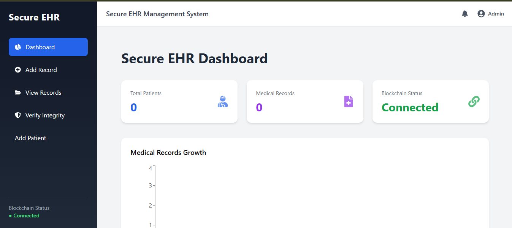

# 🏥 Secure Electronic Health Record Management System Using Blockchain


A **blockchain-secured healthcare system** that ensures medical records cannot be secretly modified.

The system stores medical data in **MySQL** while storing a **SHA-256 cryptographic hash on the Ethereum blockchain**. If the database record is modified, the system detects tampering by comparing hashes.

---

# 📌 Key Idea

Instead of storing full medical records on blockchain (which is expensive and slow), the system stores **only the cryptographic fingerprint (hash).**

```
Medical Record → SHA256 Hash → Blockchain
```

If someone edits the database record, the hash changes and the system detects it instantly.

---

# 🌍 Why This Project Matters

Healthcare data breaches are a major global problem.

This project demonstrates how **blockchain can guarantee medical record integrity** while still allowing fast database queries.

The hybrid approach provides:

- Tamper-proof verification
- Fast database performance
- Low blockchain cost
- Transparent record auditing

---

# 🧠 System Architecture



```
React Dashboard
      │
      ▼
Flask REST API
      │
      ▼
MySQL Database
(Medical Records)
      │
      ▼
SHA-256 Hash Generation
      │
      ▼
Hardhat Script (Node.js)
      │
      ▼
Ethereum Smart Contract
      │
      ▼
Blockchain Hash Storage
```

This architecture ensures:

✔ Fast database queries  
✔ Tamper-proof verification  
✔ Low blockchain storage cost  

---

# 🚀 Features

## 📊 Dashboard

- Total patients
- Total medical records
- Blockchain activity feed
- Blockchain visualization graph
- Live blockchain transaction monitor

---

## 🧾 Medical Record Management

- Add medical records
- View patient medical history
- Searchable patient record tables

---

## 🔐 Blockchain Integrity Protection

- SHA-256 hashing of medical records
- Hash storage on Ethereum blockchain
- Record verification system
- Tamper detection

---

## 📡 Blockchain Monitoring

- Live transaction feed
- Blockchain activity panel
- Hash comparison visualization

---

# ⚙️ Tech Stack

## Frontend
- React (Vite)
- TailwindCSS
- Axios
- React Router
- Framer Motion

## Backend
- Python Flask
- Flask-CORS
- MySQL Connector

## Blockchain
- Solidity
- Hardhat
- Ethers.js

## Database
- MySQL

## Cryptography
- SHA-256 hashing

---

# 🗄 Database Design

## PATIENT

| Field | Description |
|------|-------------|
| patient_id (PK) | Unique patient ID |
| age | Patient age |
| gender | Patient gender |

---

## USER_LOGIN

| Field | Description |
|------|-------------|
| user_id (PK) | User ID |
| name | User name |
| role | User role |

Roles:

- Doctor  
- Admin  
- Patient  

---

## MEDICAL_RECORD

| Field | Description |
|------|-------------|
| record_id (PK) | Record ID |
| patient_id | Linked patient |
| doctor_id | Doctor ID |
| diagnosis | Diagnosis details |
| prescription | Medicine information |
| date | Record creation date |

---

## BLOCKCHAIN_TRANSACTION

| Field | Description |
|------|-------------|
| transaction_id | Blockchain transaction ID |
| record_id | Linked record |
| patient_id | Patient ID |
| block_hash | Stored blockchain hash |
| timestamp | Transaction timestamp |

---

# ⛓ Smart Contract

The Solidity smart contract stores the **cryptographic hash of medical records**.

### Functions

```
storeRecord(uint patientId, string recordHash)
getRecord(uint recordId)
getTotalRecords()
```

Each stored block contains:

- patientId
- recordHash
- timestamp

---

# 🔌 API Endpoints

## System

```
GET /
```

---

## Users

```
GET /users
POST /users
```

---

## Patients

```
GET /patients
POST /patients
```

---

## Records

```
POST /records
GET /records/<patient_id>
```

---

## Verification

```
GET /records/verify/<record_id>
```

Response:

```
VALID
```

or

```
TAMPERED
```

---

## Dashboard

```
GET /dashboard
```

Returns:

- total_patients
- total_records
- latest_records

---

# 🧪 Example Workflow

## Adding a Medical Record

```
Doctor adds record
        │
        ▼
Record stored in MySQL
        │
        ▼
SHA256 hash generated
        │
        ▼
Hash stored on Ethereum blockchain
        │
        ▼
Transaction logged in blockchain table
```

---

## Verifying Record Integrity

```
User requests verification
        │
        ▼
Retrieve database record
        │
        ▼
Recalculate SHA256 hash
        │
        ▼
Compare with blockchain hash
```

Result:

```
VALID
```

or

```
TAMPERED
```

---

# 🔎 Tamper Detection Example

1️⃣ Record stored normally  
2️⃣ Blockchain hash stored  
3️⃣ Someone edits the database record  

Verification result:

```
TAMPERED
```

This demonstrates **blockchain-based medical data integrity protection**.

---

# 📂 Project Structure

```
Secure EHR Blockchain
│
├── backend
│   ├── app.py
│   ├── db.py
│   └── requirements.txt
│
├── blockchain
│   ├── contracts
│   │   └── EHR.sol
│   ├── scripts
│   │   ├── deploy.js
│   │   └── storeHash.js
│   └── hardhat.config.js
│
├── frontend
│   └── ehr-frontend
│       └── src
│           ├── components
│           ├── pages
│           └── api.js
│
└── README.md
```

---

# ⚡ Installation

## Clone Repository

```bash
git clone https://github.com/SanyamRajSingh/Secure-EHR-Blockchain.git
cd secure-ehr-blockchain
```

---

## Backend Setup

```bash
cd backend
python -m venv venv
venv\Scripts\activate
pip install -r requirements.txt
```

Run backend:

```bash
python app.py
```

---

## Blockchain Setup

```bash
cd blockchain
npm install
```

Start blockchain node:

```bash
npx hardhat node
```

Deploy contract:

```bash
npx hardhat run scripts/deploy.js --network localhost
```

---

## Frontend Setup

```bash
cd frontend/ehr-frontend
npm install
npm run dev
```

Open in browser:

```
http://localhost:5173
```

---

# 📈 Future Improvements

- IPFS storage for medical files
- Role-based authentication
- Cloud deployment
- Smart contract event listeners
- Blockchain explorer dashboard
- Doctor & patient dropdown selectors

---

# 🧠 Skills Demonstrated

- Full Stack Development
- REST API Development
- Blockchain Smart Contracts
- Web3 Integration
- Cryptographic Hashing
- Database Design
- System Architecture

---

# 👨‍💻 Author

**Sanyam Raj Singh Dodiya**

Secure Electronic Health Record Management System Using Blockchain

---

⭐ If you found this project interesting, consider starring the repository.